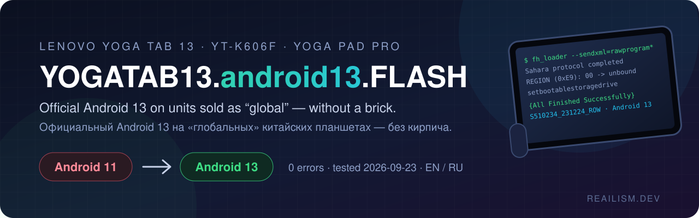
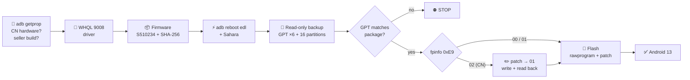
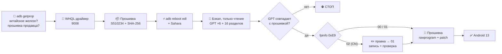

<div align="center">

> 🇷🇺 **Русская версия доступна ниже** — [перейти к русской документации ↓](#ru)



# 📲 YOGATAB13.android13.FLASH

**Take a Lenovo Yoga Tab 13 (YT-K606F) from a dead-end Android 11 to official Android 13 without bricking it.**


[**Quick start**](#-quick-start) · [**The 9 steps**](#-the-9-steps) · [**Agent playbook**](AGENT_INSTRUCTIONS.md) · [**Links & SHA-256**](LINKS.md) · [**Xiaomi remote bonus**](docs/xiaomi_remote.md) · [**Русский**](#ru)

</div>

---

Bought a Yoga Tab 13 / YOGA Pad Pro on Ozon Global or AliExpress? Chances are it's **Chinese hardware running a seller's
fake-global Android 11** (`S200021`, security patch from 2021) that will never get an OTA. Lenovo's own rescue tool
**bricks** exactly these units, the popular Qualcomm driver **doesn't even load on Windows 11**, and forum guides
contradict each other about the region lock.

**YOGATAB13.android13.FLASH** is the tested, end-to-end procedure. It covers which firmware, which driver, where the
region byte lives, what the flash overwrites and what it keeps, and a playbook an AI agent can follow step by step.
All of it was proven on a real unit: **0 errors, Android 13 boots.**

## 🔁 Before → after

| | Before | After |
|---|---|---|
| **Firmware** | `YT-K606F_S200021_210415_ROW` (seller's fake-global) | `YT-K606F_S510234_231224_ROW` (official Lenovo ROW) |
| **Android** | 11 | **13** |
| **Security patch** | 2021-03-05 | **2023-12-05** |
| **Google Play / OTA** | stuck, no updates | full Google, official ROW build |
| **Serial, Wi-Fi/BT calibration** | ✅ | ✅ untouched (`persist`, `fpinfo`, `modemst` preserved) |
| **Time on the wire** | — | **176 s** over firehose, 0 ERROR / 0 NAK |

## 🔥 Why you'll love it

| ❌ The trap | ✅ What this repo does |
|---|---|
| "Is there Android 14?" — forums say maybe | **No.** Lenovo officially cancelled A14 (2024-11-28), and no GSI has ever booted on K606F. **A13 ROW is the ceiling** |
| Lenovo Software Fix bricks CN units with `S200021` | Flashes over **EDL/firehose** with `fh_loader`, the same thing QFIL does, fully logged |
| Win11 blocks the 2014 Qualcomm 9008 driver → *"Failed to open com port handle"* | Installs the **WHQL driver from Microsoft Update Catalog**, signature-checked |
| Region lock: "change 02 to 01" — but where? and is it even 02? | Documents the **`fpinfo` byte `0xE9`**. Many seller units are already `00`, so check it and don't write blindly |
| Fear of losing serial number / Wi-Fi calibration | Proves the package **never touches** `persist`, `fpinfo`, `modemst`, `fsg`, `devinfo`, and backs them up anyway |
| Latest build `S510488` won't load in QFIL (`contents.x`) and won't charge when off | Recommends **`S510234_231224_ROW`** (A13, clean package), with SHA-256 |
| Dead links everywhere | Every link verified, with sizes and **SHA-256** in [`LINKS.md`](LINKS.md) |

## 🗺️ How it flows



## 🖥️ What it looks like

Real output from the tested run (serial masked):

```
PS> scripts\edl_enter_and_sahara.ps1 -Programmer firmware\S510234\prog_firehose_ddr.elf
adb reboot edl
EDL port: COM4
File transferred successfully · Sahara protocol completed

PS> python scripts\gpt_compare.py --device backups\gpt --package firmware\S510234
LUN0: device 18 / package 18 partitions, differences: 1
   DIFF (0, 'userdata', (1790760, 61933562), (1790760, 1790759))   <- placeholder, patched
LUN1..LUN5: differences: 0
RESULT: OK

PS> python scripts\fpinfo_inspect.py backups\partitions\fpinfo.bin
country code (0x00): CNXX
model        (0x14): LenovoYT-K606F_PRC
serial       (0xAA): 8SSP*******************
REGION       (0xE9): 00  -> unbound (00)        <- flash ROW directly

PS> scripts\flash_firmware.ps1 -Port COM4 -FirmwareDir firmware\S510234
Sending <setbootablestoragedrive>
{All Finished Successfully}
Overall to target 175.953 seconds (38.99 MBps)
ERROR/NAK lines: 0
```

## 🧭 The 9 steps

| # | Step | What happens | Script |
|---|---|---|---|
| 1 | **Identify** | `getprop`: CN hardware? seller build? battery ≥ 50 % | [AGENT_INSTRUCTIONS](AGENT_INSTRUCTIONS.md#step-0--identify-the-device-read-only) |
| 2 | **Driver** | Remove blocked 2014 Qualcomm packages, install WHQL 9008 v2.1.1.0 | [install_qualcomm_whql_driver.ps1](scripts/install_qualcomm_whql_driver.ps1) |
| 3 | **Firmware** | Download S510234, SHA-256, unzip, sanity-check the package | [verify_firmware.ps1](scripts/verify_firmware.ps1) |
| 4 | **EDL** | `adb reboot edl` → load firehose immediately (RAM only) | [edl_enter_and_sahara.ps1](scripts/edl_enter_and_sahara.ps1) |
| 5 | **Backup** | GPT of all 6 UFS LUNs + 16 unique partitions + SHA-256 (read-only) | [backup_partitions.ps1](scripts/backup_partitions.ps1) |
| 6 | **Compare** | Device GPT vs package GPT — only `userdata` end may differ | [gpt_compare.py](scripts/gpt_compare.py) |
| 7 | **Region** | `fpinfo` byte `0xE9`: `00`/`01` → go, `02` → patch to `01` | [fpinfo_inspect.py](scripts/fpinfo_inspect.py) · [write_fpinfo.ps1](scripts/write_fpinfo.ps1) |
| 8 | **Flash** | rawprogram* + patch*, bootable LUN 1, reset (~3 min) | [flash_firmware.ps1](scripts/flash_firmware.ps1) |
| 9 | **Verify** | First boot 5–10 min → `ro.build.display.id` = `S510234`, Android 13 | [AGENT_INSTRUCTIONS](AGENT_INSTRUCTIONS.md#step-7--verify) |

## ✨ Features

- 🤖 **Agent-ready playbook**: [`AGENT_INSTRUCTIONS.md`](AGENT_INSTRUCTIONS.md) is written for Claude Code and similar agents.
  Reads are free, every write needs a human "yes", and there are hard stop conditions.
- 🧊 **Read-only first**: backups, GPT comparison and region check all happen *before* anything is written.
- 🔐 **Nothing blind**: firmware SHA-256, Authenticode/WHQL signature checks, 1-byte-diff guard on `fpinfo`, write-and-read-back verification.
- 🗂️ **Region-lock map**: the full [`fpinfo` layout](docs/fpinfo_layout.md), offset by offset.
- 📚 **Research, condensed**: 4PDA (1100+ posts), XDA, Lenovo forums, Reddit, zui.com, summed up in [`docs/research.md`](docs/research.md).
- 📺 **Bonus, Xiaomi Mi Box remote**: Home and Mic buttons dead on the tablet? Fixed without root. Mic → **Gemini**.
  See [`docs/xiaomi_remote.md`](docs/xiaomi_remote.md).

## ⚡ Quick start

> Requirements: Windows 10/11, PowerShell, Python 3, ~15 GB free, a USB cable, tablet charged ≥ 50 %.
> **Flashing wipes all data on the tablet.**

**Option A — release zip:** download `YOGATAB13.android13.FLASH-v1.0.0.zip` from
[Releases](https://github.com/dobrdigital/YOGATAB13.android13.FLASH/releases/latest) and extract it.

**Option B — straight from source:**

```powershell
git clone https://github.com/dobrdigital/YOGATAB13.android13.FLASH
cd YOGATAB13.android13.FLASH
```

**Then:**

- 🤖 **With an agent:** open the folder in Claude Code and say *"follow AGENT_INSTRUCTIONS.md"*.
- 🧑‍🔧 **By hand:** follow [`AGENT_INSTRUCTIONS.md`](AGENT_INSTRUCTIONS.md) step by step. Every command is there.

Downloads (firmware, QPST, driver, adb, Key Mapper) with SHA-256 are in [`LINKS.md`](LINKS.md).

## 🔒 Safe & reversible

- 🧯 EDL lives in the SoC's boot ROM, so a failed software flash can always be redone over 9008.
- 🛡️ The package **does not write** `persist`, `fpinfo`, `frp`, `modemst1/2`, `fsg`, `devinfo` (empty `filename` in `rawprogram`).
- 🚫 `provision_*.xml` (UFS provisioning) is **never** sent.
- 🙈 Your backups stay local. `.gitignore` blocks `*.bin`, `*.img`, `backups/`, and the issue form asks you not to paste serials/MACs.

## 📝 Report your result

Flashed your unit (or bricked it)? Open a [flash report](../../issues/new?template=flash_report.yml). Starting build,
region byte and outcome make this safer for the next person.

## 📄 License

[MIT](LICENSE). Firmware, QPST and drivers are not included and belong to Lenovo, Qualcomm, Microsoft and Google.
Flashing voids warranty and is at your own risk.

---

<div align="center">

*Built with ❤ at **REAILISM.DEV** — because a flagship-class tablet deserves better than Android 11.*

</div>

---

<a name="ru"></a>

<details>
<summary><b>🇷🇺 Русская документация — нажмите, чтобы развернуть</b></summary>

<br>

<div align="center">

# 📲 YOGATAB13.android13.FLASH

**Как перевести Lenovo Yoga Tab 13 (YT-K606F) с тупикового Android 11 на официальный Android 13 и не окирпичить.**

[**Быстрый старт**](#-быстрый-старт) · [**9 шагов**](#-9-шагов) · [**Инструкция для агента**](AGENT_INSTRUCTIONS.md) · [**Ссылки и SHA-256**](LINKS.md) · [**Бонус: пульт Xiaomi**](docs/xiaomi_remote.md)

</div>

---

Купили Yoga Tab 13 / YOGA Pad Pro на Ozon Global или AliExpress? Скорее всего, это **китайское железо с псевдоглобальной
прошивкой продавца на Android 11** (`S200021`, патч безопасности 2021 года), которая никогда не обновится. Фирменная
утилита Lenovo **окирпичивает** именно такие планшеты, популярный драйвер Qualcomm **не запускается на Windows 11**,
а инструкции на форумах противоречат друг другу насчёт региональной блокировки.

**YOGATAB13.android13.FLASH** — проверенная процедура целиком: какая прошивка, какой драйвер, где лежит байт региона,
что прошивка перезаписывает и что сохраняет, плюс инструкция, по которой ИИ-агент может пройти всё пошагово.
Проверено на живом планшете: **0 ошибок, Android 13 загружается.**

## 🔁 Было → стало

| | Было | Стало |
|---|---|---|
| **Прошивка** | `YT-K606F_S200021_210415_ROW` (псевдоглобалка продавца) | `YT-K606F_S510234_231224_ROW` (официальная Lenovo ROW) |
| **Android** | 11 | **13** |
| **Патч безопасности** | 05.03.2021 | **05.12.2023** |
| **Google Play / обновления** | застрял, обновлений нет | полноценный Google, официальная сборка |
| **Серийник, калибровки Wi-Fi/BT** | ✅ | ✅ не тронуты (`persist`, `fpinfo`, `modemst` сохраняются) |
| **Время прошивки** | — | **176 с** через firehose, 0 ERROR / 0 NAK |

## 🔥 Почему это работает

| ❌ Ловушка | ✅ Что делает этот репозиторий |
|---|---|
| «А Android 14 будет?» — на форумах «может быть» | **Нет.** Lenovo официально отменила A14 (28.11.2024), GSI на K606F ни у кого не загрузился. **Потолок — A13 ROW** |
| Lenovo Software Fix окирпичивает китайские планшеты с `S200021` | Шьём через **EDL/firehose** утилитой `fh_loader` (то же, что делает QFIL), с полным логом |
| Windows 11 блокирует драйвер 9008 2014 года → *«Failed to open com port handle»* | Ставим **WHQL-драйвер из Microsoft Update Catalog** с проверкой подписи |
| «Поменяйте 02 на 01» — но где? И точно ли там 02? | Описан **байт `0xE9` в разделе `fpinfo`**. У многих продавцов там уже `00`: проверьте, не пишите вслепую |
| Страшно потерять серийник и калибровку Wi-Fi | Доказано, что прошивка **не трогает** `persist`, `fpinfo`, `modemst`, `fsg`, `devinfo`, и они всё равно бэкапятся |
| Последняя `S510488` не грузится в QFIL (`contents.x`) и не заряжается выключенной | Рекомендуем **`S510234_231224_ROW`** (A13, чистый пакет), с SHA-256 |
| Мёртвые ссылки везде | Каждая ссылка проверена, с размером и **SHA-256** в [`LINKS.md`](LINKS.md) |

## 🗺️ Как это устроено



## 🖥️ Как это выглядит

Реальный вывод с проверенного планшета (серийник замаскирован): см. блок [«What it looks like»](#️-what-it-looks-like) выше. Команды
и результат одинаковы для обоих языков.

## 🧭 9 шагов

| # | Шаг | Что происходит | Скрипт |
|---|---|---|---|
| 1 | **Диагностика** | `getprop`: китайское железо? прошивка продавца? батарея ≥ 50 % | [AGENT_INSTRUCTIONS](AGENT_INSTRUCTIONS.md#step-0--identify-the-device-read-only) |
| 2 | **Драйвер** | Удалить заблокированные пакеты Qualcomm 2014, поставить WHQL 9008 v2.1.1.0 | [install_qualcomm_whql_driver.ps1](scripts/install_qualcomm_whql_driver.ps1) |
| 3 | **Прошивка** | Скачать S510234, сверить SHA-256, распаковать, проверить пакет | [verify_firmware.ps1](scripts/verify_firmware.ps1) |
| 4 | **EDL** | `adb reboot edl` → сразу загрузить firehose (только в ОЗУ) | [edl_enter_and_sahara.ps1](scripts/edl_enter_and_sahara.ps1) |
| 5 | **Бэкап** | GPT всех 6 LUN + 16 уникальных разделов + SHA-256 (только чтение) | [backup_partitions.ps1](scripts/backup_partitions.ps1) |
| 6 | **Сверка** | GPT планшета против GPT прошивки — отличаться может только конец `userdata` | [gpt_compare.py](scripts/gpt_compare.py) |
| 7 | **Регион** | Байт `0xE9` в `fpinfo`: `00`/`01` → шьём, `02` → сначала `01` | [fpinfo_inspect.py](scripts/fpinfo_inspect.py) · [write_fpinfo.ps1](scripts/write_fpinfo.ps1) |
| 8 | **Прошивка** | rawprogram* + patch*, загрузочный LUN 1, перезагрузка (~3 мин) | [flash_firmware.ps1](scripts/flash_firmware.ps1) |
| 9 | **Проверка** | Первый запуск 5–10 мин → `ro.build.display.id` = `S510234`, Android 13 | [AGENT_INSTRUCTIONS](AGENT_INSTRUCTIONS.md#step-7--verify) |

## ✨ Возможности

- 🤖 **Инструкция для агента**: [`AGENT_INSTRUCTIONS.md`](AGENT_INSTRUCTIONS.md) написана для Claude Code и похожих агентов.
  Чтение свободно, любая запись — только после «да» от человека, есть жёсткие условия остановки.
- 🧊 **Сначала только чтение**: бэкапы, сверка GPT и проверка региона — *до* любой записи.
- 🔐 **Ничего вслепую**: SHA-256 прошивки, проверка подписей Authenticode/WHQL, защита «ровно один байт» для `fpinfo`, запись с обратным чтением.
- 🗂️ **Карта региональной блокировки**: полный [формат `fpinfo`](docs/fpinfo_layout.md) по смещениям.
- 📚 **Исследование в сжатом виде**: 4PDA (1100+ постов), XDA, форумы Lenovo, Reddit, zui.com — в [`docs/research.md`](docs/research.md).
- 📺 **Бонус: пульт Xiaomi Mi Box**: кнопки «Домой» и микрофон не работают на планшете? Чинится без root. Микрофон → **Gemini**.
  Подробно: [`docs/xiaomi_remote.md`](docs/xiaomi_remote.md).

## ⚡ Быстрый старт

> Нужно: Windows 10/11, PowerShell, Python 3, ~15 ГБ свободного места, USB-кабель, заряд планшета ≥ 50 %.
> **Прошивка стирает все данные на планшете.**

**Вариант A — архив из релиза:** скачайте `YOGATAB13.android13.FLASH-v1.0.0.zip` со страницы
[Releases](https://github.com/dobrdigital/YOGATAB13.android13.FLASH/releases/latest) и распакуйте.

**Вариант B — из исходников:**

```powershell
git clone https://github.com/dobrdigital/YOGATAB13.android13.FLASH
cd YOGATAB13.android13.FLASH
```

**Дальше:**

- 🤖 **С агентом:** откройте папку в Claude Code и скажите *«следуй AGENT_INSTRUCTIONS.md»*.
- 🧑‍🔧 **Вручную:** идите по [`AGENT_INSTRUCTIONS.md`](AGENT_INSTRUCTIONS.md) шаг за шагом (на англ.), все команды там.

Загрузки (прошивка, QPST, драйвер, adb, Key Mapper) с SHA-256 — в [`LINKS.md`](LINKS.md).

## 📺 Бонус: пульт Xiaomi Mi Box

Пульт от приставки Xiaomi подключается к планшету по Bluetooth, стрелки, ОК, «Назад» и громкость работают сразу.
А **«Домой» и микрофон молчат**: пульт шлёт их как клавиши ПК-клавиатуры (`MOVE_HOME` и `F5`), а не как Android TV-кнопки.
Без root лечится приложением **Key Mapper**: «Домой» → на главный экран, микрофон → **Gemini** (голос слушает микрофон
планшета; для Gemini нужен VPN в стране, где он доступен, у нас сработала Канада). Подробно: [`docs/xiaomi_remote.md`](docs/xiaomi_remote.md).

## 🔒 Безопасно и обратимо

- 🧯 EDL зашит в ПЗУ процессора, поэтому неудачную программную прошивку всегда можно повторить через 9008.
- 🛡️ Прошивка **не пишет** `persist`, `fpinfo`, `frp`, `modemst1/2`, `fsg`, `devinfo` (пустой `filename` в `rawprogram`).
- 🚫 `provision_*.xml` (перенастройка UFS) **никогда** не отправляется.
- 🙈 Бэкапы остаются у вас. `.gitignore` не пустит в репозиторий `*.bin`, `*.img`, `backups/`, а форма отчёта просит не публиковать серийники и MAC.

## 📝 Сообщите о результате

Прошили планшет (или окирпичили)? Оставьте [отчёт о прошивке](../../issues/new?template=flash_report.yml): исходная прошивка,
байт региона и результат помогут следующему человеку.

## 📄 Лицензия

[MIT](LICENSE). Прошивки, QPST и драйверы в репозиторий не входят и принадлежат Lenovo, Qualcomm, Microsoft и Google.
Прошивка лишает гарантии, вы действуете на свой риск.

---

<div align="center">

*Сделано с ❤ в **REAILISM.DEV** — потому что планшет флагманского класса заслуживает большего, чем Android 11.*

</div>

</details>
